# pi-git-sync 架构与逻辑文档

> 版本：0.2.x（config schema v2，state schema v3）  
> 最后更新：2026-07-27

## 目录

1. [概述](#1-概述)
2. [项目结构](#2-项目结构)
3. [核心数据模型](#3-核心数据模型)
4. [模块架构](#4-模块架构)
5. [路径与安全层](#5-路径与安全层)
6. [同步锁](#6-同步锁)
7. [同步状态与基线](#7-同步状态与基线)
8. [三方比较引擎](#8-三方比较引擎)
9. [核心流程](#9-核心流程)
10. [安全机制](#10-安全机制)

---

## 1. 概述

pi-git-sync 是一个 Pi 扩展，通过 **Git 私有仓库** 在多台机器之间同步 Pi 配置。核心模型为：

> **单一配置分支 + root 镜像目录 + Glob 白名单 + 同步基线三方比较**

```
┌─────────────┐      push/pull       ┌──────────────┐
│  Machine A  │ ◄──────────────────► │  GitHub Repo │
│  (Pi agent) │                      │  (Private)   │
└─────────────┘                      └──────────────┘
                                            ▲
┌─────────────┐                             │
│  Machine B  │ ◄───────────────────────────┘
│  (Pi agent) │
└─────────────┘
```

### 关键设计决策

| 决策 | 说明 |
| ------ | ------ |
| `settings.json` 整文件共享 | 不做 key-level merge，所有设备用同一份 |
| 仓库不作为 Pi Package 安装 | 避免 Extension/Skill 重复加载 |
| 单向 mirror（`sync/` ↔ agent dir） | 相同相对路径，Git diff 直观 |
| 三方比较（Baseline / Local / Remote） | 识别创建、删除、双边冲突；可快进设备分支自动合入 |
| 仅 fast-forward pull | 有分叉就停止，不自动合并 |
| push 链: capture → commit → rebase → push → apply | 确保 rebase 后 agent 与 repo 一致 |

---

## 2. 项目结构

```
pi-git-sync/
├── index.ts                  # Extension 入口：注册命令、事件、TUI
├── package.json
├── scripts/
│   └── bootstrap.sh          # 新机器自举脚本
├── src/
│   ├── commands.ts           # /pisync 命令路由 + push/pull/init 完整流程
│   ├── config.ts             # pi-sync.json schema v2 加载 & 校验
│   ├── inventory.ts          # 三方文件比较引擎（baseline vs local vs remote）
│   ├── capture.ts            # agent → repo 变更捕获
│   ├── materialize.ts        # repo → agent 文件写入（原子 + 安全）
│   ├── git.ts                # Git 操作封装（status/fetch/pull/push/rebase）
│   ├── backup.ts             # 备份 & 恢复（apply 前完整备份）
│   ├── lock.ts               # 并发锁（pid 级，含 staleness 检测）
│   ├── security.ts           # hard deny 列表 + secret scanning
│   ├── glob.ts               # minimatch glob + 路径规范化 + 安全检查
│   ├── state.ts              # 同步基线持久化（<config-repo>/.pi-sync/state.json，Git ignored）
│   ├── packages.ts           # settings.json packages[] 解析、审批、执行与回滚
│   ├── path-safety.ts        # repo/agent root 与 symlink 边界
│   ├── operation-result.ts   # 结构化命令结果
│   ├── doctor.ts             # 环境诊断（git/ssh/portability）
│   ├── validate.ts           # JSON / conflict marker / settings 可移植性校验
│   ├── settings.ts           # v1 遗留（deepMerge/deepEqual）
│   ├── ui.ts                 # 格式化输出（status/diff/backup/capture）
│   └── minimatch.ts          # 独立 minimatch 实现（备用）
└── test/
    ├── helpers/              # temp-env, git-fixture, fake-pi, factories
    ├── e2e/                  # 两设备端到端测试
    ├── *.test.ts             # 33 个测试文件，282 个测试
    └── ...
```

---

## 3. 核心数据模型

### 3.1 三方比较模型

每次同步操作比较三个状态：

```
┌──────────────────────────────────────────┐
│                三方比较                    │
│                                          │
│   B = Baseline (state.json)              │
│   L = Local    (agent 文件)               │
│   R = Remote   (repo sync/ 文件)          │
│                                          │
│   "不存在" 也作为一种值参与比较           │
└──────────────────────────────────────────┘
```

### 3.2 13 种变更分类

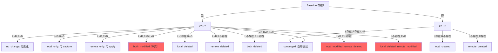

### 3.3 同步基线 (state.json)

```json
{
  "schemaVersion": 3,
  "repoPath": "/Users/xxx/.pi/config-repo",
  "branch": "main",
  "lastSyncedCommit": "abc123...",
  "lastSyncedAt": "2026-07-26T00:00:00Z",
  "files": {
    "settings.json": { "sha256": "...", "mode": 420 },
    "prompts/welcome.md": { "sha256": "...", "mode": 420 }
  },
  "pendingOperation": null,
  "lastBackup": "2026-07-26T00-00-00Z",
  "migrationReport": {
    "fromSchema": 2,
    "reconciled": [],
    "removed": [],
    "conflicts": []
  }
}
```

v2 → v3 迁移会先备份旧 state。只有 local/repo hash 相同的路径会自动写入新 baseline；
两边都不存在的路径会移除。差异、不可用路径和 symlink 会保留旧 baseline，并写入
`migrationReport.conflicts`，等待 doctor/status 引导人工处理。

### 3.4 配置清单 (pi-sync.json)

```json
{
  "schemaVersion": 2,
  "branch": "main",
  "root": "sync",
  "include": ["settings.json", "extensions/**", "skills/**", "prompts/**", "themes/**"],
  "exclude": ["**/.DS_Store", "**/*.tmp"],
  "delete": "tracked",
  "security": { "scanSecretsBeforePush": true }
}
```

---

## 4. 模块架构

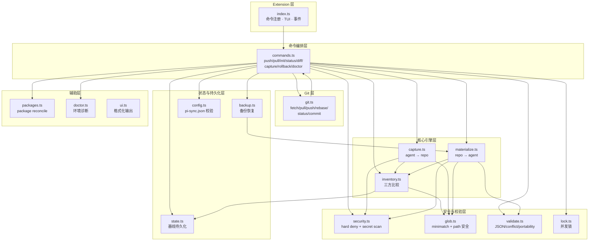

---

## 5. 路径与安全层

### 5.1 路径规范化

```
输入路径                    →  规范化后
========================================
"themes\\dark.json"        →  "themes/dark.json"
"./prompts/hello.md"       →  "prompts/hello.md"
"extensions//foo.ts"       →  "extensions/foo.ts"
"/etc/passwd"              →  ❌ 拒绝（绝对路径）
"../../.ssh/id_rsa"        →  ❌ 拒绝（.. 逃逸）
"C:\\Users\\..."           →  ❌ 拒绝（盘符路径）
"file\0hidden.txt"         →  ❌ 拒绝（NUL 字符）
```

### 5.2 Glob 白名单优先级

```
内置 hard deny  >  manifest exclude  >  manifest include
     ↑                    ↑                    ↑
   最高优先级           次优先级            最低优先级
```

```
┌──────────────────────────────────────────────────┐
│              isPathAllowed(relPath)               │
│                                                  │
│  1. 遍历 BUILTIN_HARD_DENY                       │
│     ├── auth.json → DENIED                       │
│     ├── sessions/** → DENIED                     │
│     ├── **/.env → DENIED                         │
│     └── ...                                      │
│                                                  │
│  2. 检查 include 白名单                           │
│     ├── 匹配 → 继续                               │
│     └── 不匹配 → NOT_IN_INCLUDE (静默跳过)        │
│                                                  │
│  3. 检查 exclude 列表                             │
│     ├── 匹配 → EXCLUDED (静默跳过)                │
│     └── 不匹配 → ALLOWED ✓                       │
└──────────────────────────────────────────────────┘
```

### 5.3 符号链接与 root 边界

`path-safety.ts` 会检查 repo root、sync root、agent 路径以及每一级已存在组件。
root、目录、文件或 dangling symlink 都会阻断操作；不会跟随 symlink，也不会再静默
跳过危险路径。backup、restore、capture、materialize、inventory 和 doctor 共用这一策略。

### 5.4 Hard Deny 列表（不可覆盖）

```
auth.json          sessions/**        trust.json
models-store.json  npm/**             git/**
node_modules/**    .pi-sync/**        **/.env
**/*.pem           **/id_rsa          **/id_ed25519
```

---

## 6. 同步锁

```
┌────────────────────────────────────────┐
│         SyncLock (PID 级别)             │
│                                        │
│  lockfile: .pi-sync/sync.lock          │
│                                        │
│  {                                     │
│    "pid": 12345,                       │
│    "hostname": "macbook",              │
│    "startedAt": "2026-...",            │
│    "operation": "push"                 │
│  }                                     │
│                                        │
│  规则:                                  │
│  • 同一时刻仅一个进程持有锁             │
│  • 持锁进程崩溃 → stale lock 可恢复     │
│  • 非 owner 不能释放他人锁              │
│  • 释放幂等                             │
└────────────────────────────────────────┘
```

---

## 7. 同步状态与基线

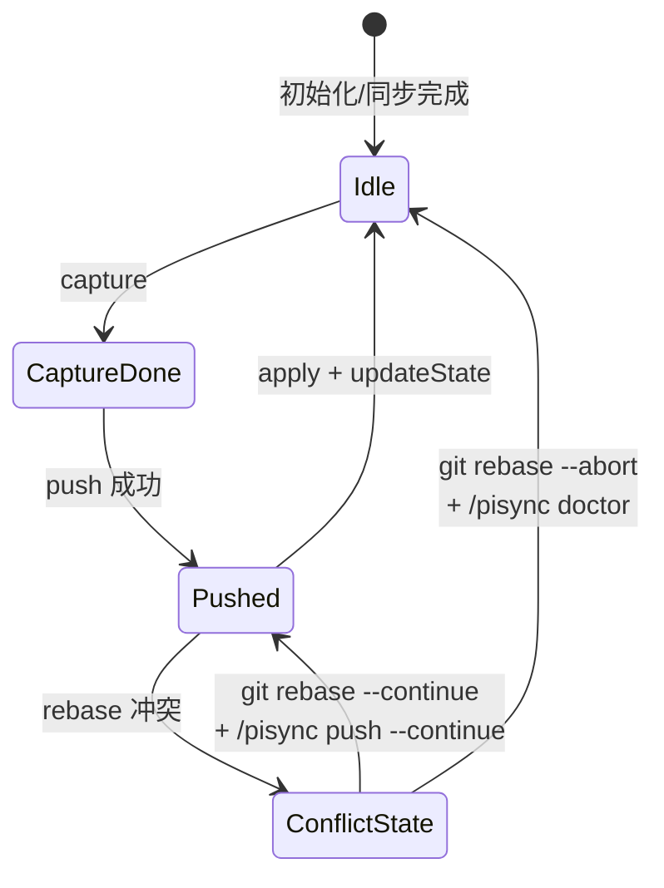

---

## 8. 三方比较引擎

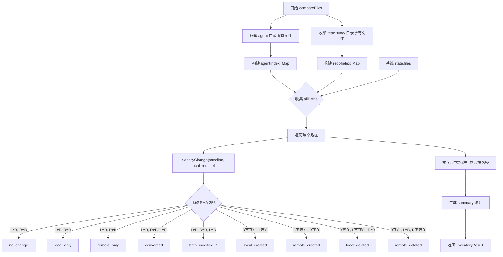

---

## 9. 核心流程

### 9.1 Push 全链路

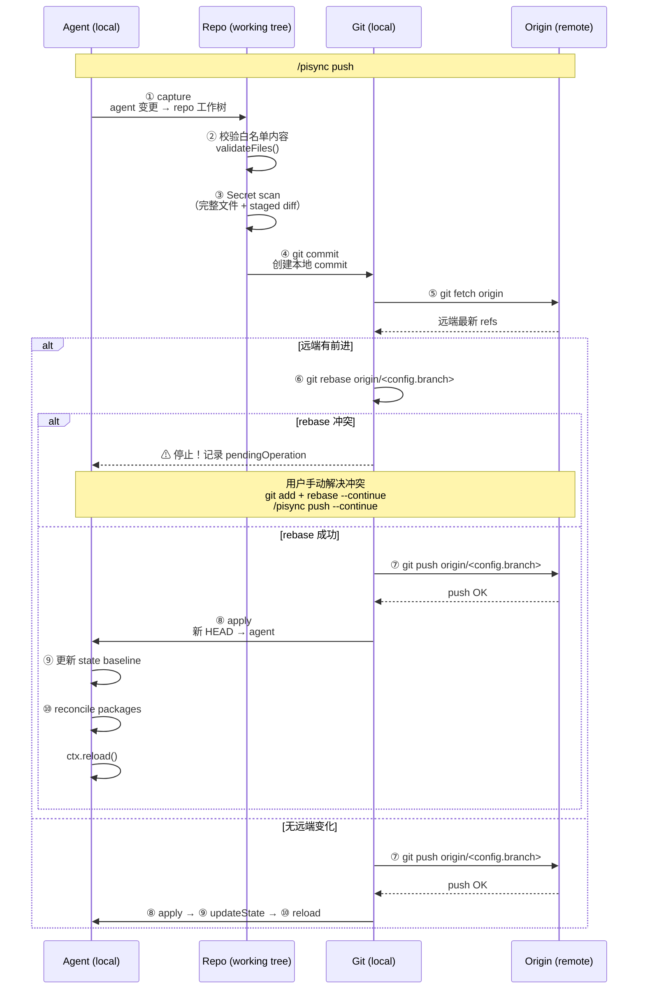

### 9.2 Pull 流程

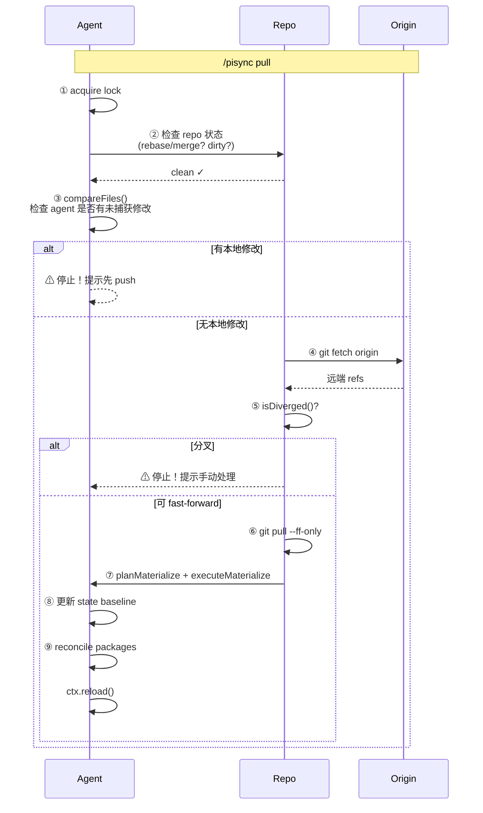

### 9.3 Package 审批与执行流程

```text
preparePackagePlan
  → 检查新增/变更 source 是否已审批
  → 未审批：返回 approval_required，不执行 pi install/remove
  → 创建备份并 materialize settings.json
  → executePackagePlan（execFile argv）
  → 安装失败：逆序移除变更 package，尝试恢复旧 source
  → 回滚失败：记录 rollbackErrors 和 apply-failed pendingOperation
  → 成功后保存 state 与 trust store，最后 reload
```

### 9.4 Capture 流程

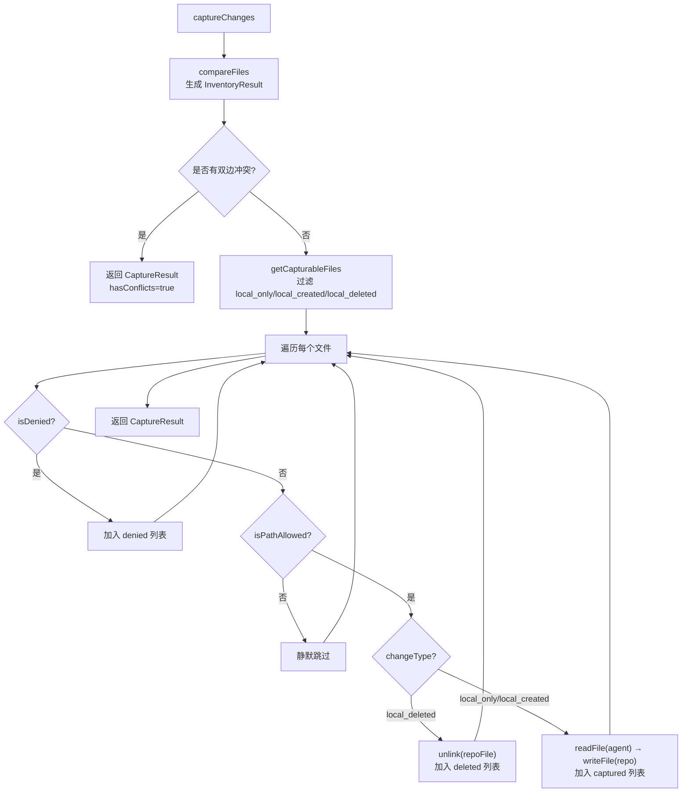

### 9.5 Materialize 流程

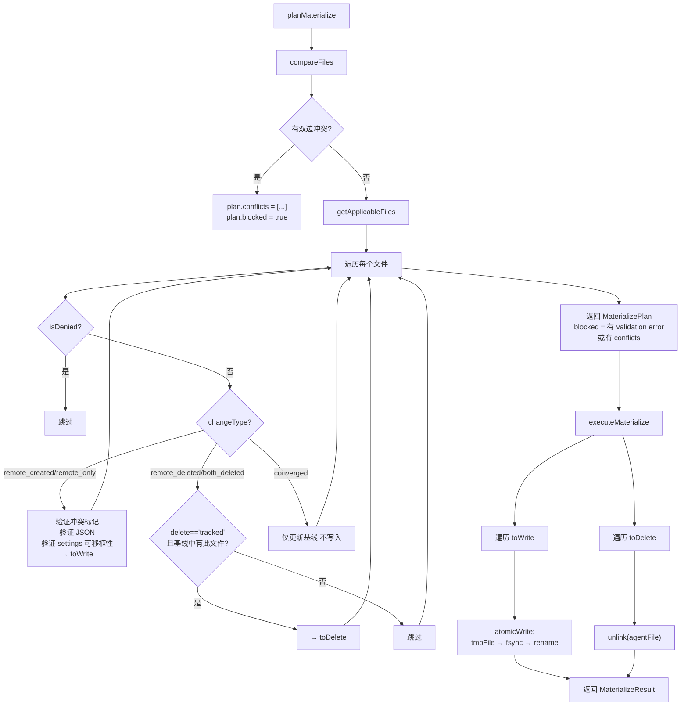

### 9.6 Init 流程

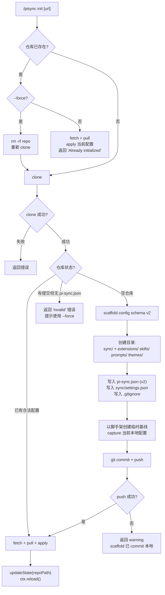

### 9.7 Push --Continue 流程

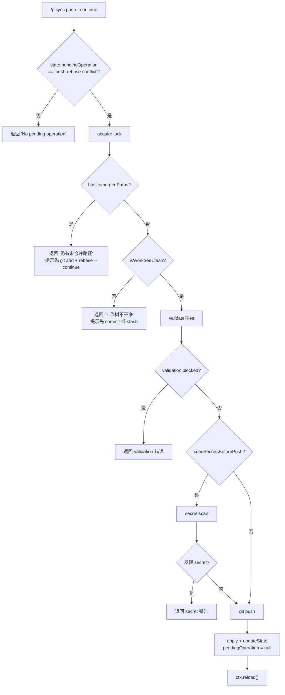

---

## 10. 安全机制

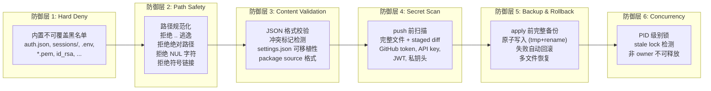

### 原子写入流程

```
┌───────────────────────────────────────────┐
│          atomicWrite(targetPath, content)  │
│                                           │
│  1. mkdir(dirname(targetPath))            │
│  2. tmpPath = ".file.XXXX.tmp"            │
│     (同目录，确保 rename 原子性)           │
│  3. writeFile(tmpPath, content, mode)     │
│  4. rename(tmpPath, targetPath)           │
│     └─ 失败 → unlink(tmpPath)             │
│  5. 抛出错误或成功返回                     │
└───────────────────────────────────────────┘
```

### Backup & Rollback

```
┌──────────────────────────────────────────┐
│  apply 前: createBackup()                │
│                                          │
│  备份目录: <config-repo>/.pi-sync/backups/<timestamp>/ │
│  ├── backup.json  (清单)                 │
│  └── data/                               │
│      ├── prompts/welcome.md              │
│      └── ...                             │
│                                          │
│  清单记录:                                │
│  • backed_up:   将被覆盖的文件 (含内容)    │
│  • will_create: 将被新建的文件 (标记)     │
│  • will_delete: 将被删除的文件 (含内容)    │
└──────────────────────────────────────────┘

┌──────────────────────────────────────────┐
│  rollback: restoreBackup()               │
│                                          │
│  1. 先备份当前状态 (pre-rollback)         │
│  2. 恢复 backed_up 文件 → 原子写入        │
│  3. 恢复 will_delete 文件 → 原子写入      │
│  4. 删除 will_create 文件 → unlink       │
│  5. hash 校验失败 → 拒绝恢复              │
│  6. 数据文件缺失 → 拒绝恢复               │
└──────────────────────────────────────────┘
```

---

## 附录 A: Git 仓库结构

```
<user>-pi-config/                  # GitHub Private Repo
├── .gitignore
├── pi-sync.json                  # 同步配置 (config schema v2)
├── .pi-sync/                     # 本机 state、备份与锁（Git ignored）
└── sync/                         # 所有同步内容
    ├── settings.json              # 共享 settings (整文件)
    ├── AGENTS.md                  # (可选)
    ├── SYSTEM.md                  # (可选)
    ├── APPEND_SYSTEM.md           # (可选)
    ├── keybindings.json           # (可选)
    ├── extensions/                # 自定义扩展
    ├── skills/                    # Skills
    ├── prompts/                   # Prompt 模板
    └── themes/                    # 主题
```

## 附录 B: 命令参考

| 命令 | 锁 | 网络 | 副作用 | 说明 |
| ------ | :--: | :----: | :------: | ------ |
| `/pisync` | - | - | - | TUI 交互菜单 |
| `/pisync init [url]` | ✅ | ✅ | clone/commit/push/apply/reload | 初始化或克隆配置仓库 |
| `/pisync status` | - | - | - | 显示三方比较 + git 状态 |
| `/pisync diff` | - | 可选 | - | 显示各类差异 |
| `/pisync pull` | ✅ | ✅ | fetch/ff/apply/reload | 拉取远端变更 |
| `/pisync push` | ✅ | ✅ | capture/commit/rebase/push/apply/reload | 推送本地变更 |
| `/pisync push --continue` | ✅ | ✅ | validate/scan/push/apply/reload | 继续冲突解决后的推送 |
| `/pisync capture` | ✅ | - | agent → repo 文件复制 | 仅捕获，不 commit/push |
| `/pisync doctor` | - | - | - | 环境诊断 |
| `/pisync rollback` | ✅ | - | 备份恢复/reload | 回滚到上一个备份 |
| `debug:clear-repo` | ✅ | ✅ | 清空本地+远端/reload | 🔴 仅调试用 |

## 附录 C: 数据流总览

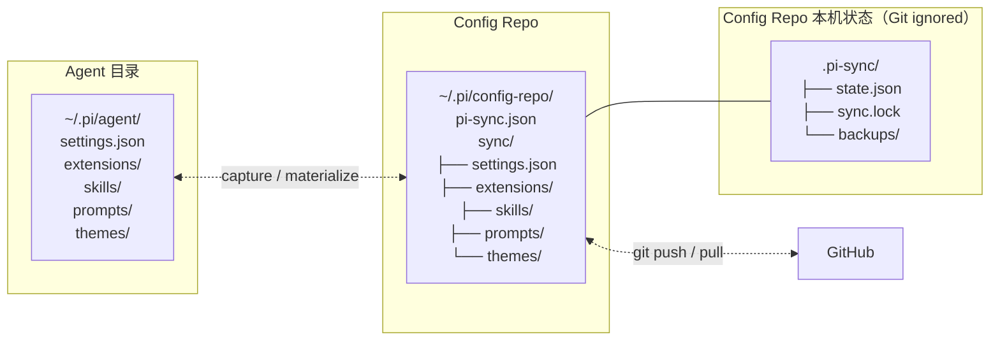
